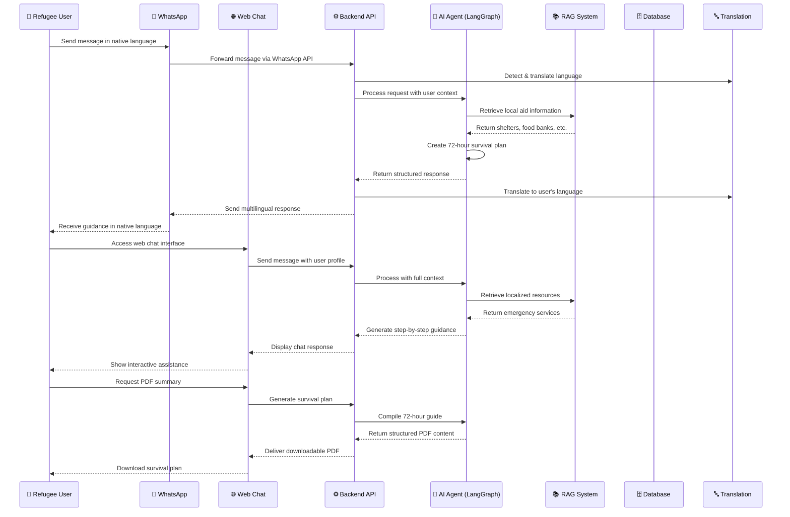

# Refugee First – 72-Hour Support Agent

A multilingual AI assistant that provides critical survival information to refugees during their first 72 hours in a new city through WhatsApp and web chat interfaces.

## Project Description

Refugee First is a humanitarian AI system specifically designed to address the urgent needs of refugees and displaced persons during the most critical period—the first 72 hours after arrival in an unfamiliar city. The system provides immediate access to life-saving information including emergency shelter locations, food and water distribution points, medical facilities, safety guidelines, and local navigation assistance. By leveraging advanced AI technologies with multilingual support, we bridge the communication gap and deliver actionable survival information to vulnerable populations when they need it most.

## 🧩 System Architecture



## Technologies Used

- **Frontend**: React, TypeScript, Tailwind CSS, HTML5
- **Backend**: FastAPI, Python 3.11+
- **AI/ML**: LangGraph, Vertex AI Embeddings, Groq API
- **Database**: MongoDB with geospatial indexing
- **Messaging**: WhatsApp Cloud API for refugee communication
- **Translation**: Google Translate API for multilingual support
- **Hosting**: Google Cloud Run, Firebase Hosting
- **Authentication**: Firebase Auth with multi-language UI

## How It Works / Architecture

The system operates through a structured pipeline:

1. **User Input**: Refugees send messages via WhatsApp or web chat in their native language (Arabic, Farsi, Hindi, Urdu, English, French, Ukrainian, Tamil, Marathi)

2. **Language Processing**: System detects language and translates to English for processing

3. **AI Analysis**: LangGraph agent analyzes the request, identifies urgency level, and determines required assistance type

4. **Location-Based Retrieval**: RAG system with Vertex AI embeddings searches localized databases for:
   - Emergency shelters and temporary housing
   - Food banks and water distribution points
   - Medical facilities and emergency services
   - Legal aid and community support centers

5. **72-Hour Planning**: AI generates a customized 72-hour survival plan prioritizing:
   - Immediate needs (shelter, food, safety)
   - Medium-term requirements (documentation, healthcare)
   - Long-term orientation (community integration, support networks)

6. **Multilingual Delivery**: Responses are translated back to the user's language and delivered through their preferred channel

## Installation / Setup Instructions

### Prerequisites
- Python 3.11+
- Node.js 18+
- MongoDB database
- Google Cloud Project with Vertex AI enabled
- WhatsApp Business API account

### Backend Setup
```bash
git clone https://github.com/your-username/refugee-first.git
cd refugee-first/backend

# Create virtual environment
python -m venv venv
source venv/bin/activate  # Windows: venv\Scripts\activate

# Install dependencies
pip install -r requirements.txt

# Set environment variables
export MONGODB_URI="your_mongodb_connection_string"
export GOOGLE_APPLICATION_CREDENTIALS="path/to/service-account.json"
export GROQ_API_KEY="your_groq_api_key"
export WHATSAPP_TOKEN="your_whatsapp_business_token"

# Start backend server
uvicorn main:app --reload --host 0.0.0.0 --port 8000
```

### Frontend Setup
```bash
cd ../frontend
npm install
npm start
```

### Database Initialization
```bash
# Import initial refugee support data
python scripts/import_shelters.py
python scripts/import_food_banks.py
python scripts/import_medical_centers.py
```

## Usage / Example

### Food and Water Request (Hindi):
```
👤 User: "भूख लगी है, खाना चाहिए"

🤖 Refugee First: "नमस्ते! आपके निकटतम भोजन वितरण केंद्र:

🍞 अन्नक्षेत्र भोजनालय - 0.5 किमी (अभी खुला)
🍎 सामुदायिक रसोई - 1.2 किमी
💧 पेयजल स्टेशन - 0.3 किमी

तत्काल सहायता:
1. पहले पानी लें
2. निकटतम भोजन केंद्र पर जाएं
3. यदि अस्वस्थ हैं तो चिकित्सक से मिलें

क्या आप विशिष्ट दिशा-निर्देश चाहते हैं?"
```

## File Structure

```
refugee-first/
├── backend/
│   ├── main.py                 # FastAPI application entry point
│   ├── agents/
│   │   ├── refugee_agent.py    # LangGraph agent implementation
│   │   └── emergency_classifier.py
│   ├── rag/
│   │   ├── retrieve.py         # RAG retrieval system
│   │   ├── vector_store.py     # Vector database management
│   │   └── data_sources/       # Local aid database
│   ├── whatsapp/
│   │   └── webhook.py          # WhatsApp message handling
│   ├── translation/
│   │   └── multilingual.py     # Language translation services
│   └── models/
│       ├── user_models.py      # User data models
│       └── aid_models.py       # Aid resource models
├── frontend/
│   ├── src/
│   │   ├── components/
│   │   │   ├── ChatInterface.jsx
│   │   │   ├── LanguageSelector.jsx
│   │   │   └── EmergencyResources.jsx
│   │   ├── pages/
│   │   │   ├── Landing.jsx
│   │   │   ├── Onboarding.jsx
│   │   │   └── Dashboard.jsx
│   │   └── utils/
│   │       ├── api.js
│   │       └── translation.js
│   └── public/
│       ├── index.html
│       └── manifest.json
├── database/
│   ├── init_db.py              # Database initialization
│   └── sample_data/            # Refugee support resources
├── docs/
│   ├── API.md
│   └── DEPLOYMENT.md
├── docker-compose.yml
├── requirements.txt
└── README.md
```

## Live Demo

**Web Portal**: [https://refugee-first.web.app](https://refugee-first.web.app)  
**Demo Video**: [https://drive.google.com/file/d/1EvefO1SAihRdXT55CqyduXXM3emgixbw/view](https://drive.google.com/file/d/1EvefO1SAihRdXT55CqyduXXM3emgixbw/view)

## Humanitarian Focus

This project strictly adheres to humanitarian principles:
- Provides information only, no automation of legal/government processes
- Respects user privacy and data protection
- Supports vulnerable populations without commercial motives
- Multilingual accessibility for true inclusion
- No military, surveillance, or commercial usage permitted

## License

Humanitarian Use License - See LICENSE.md for details
