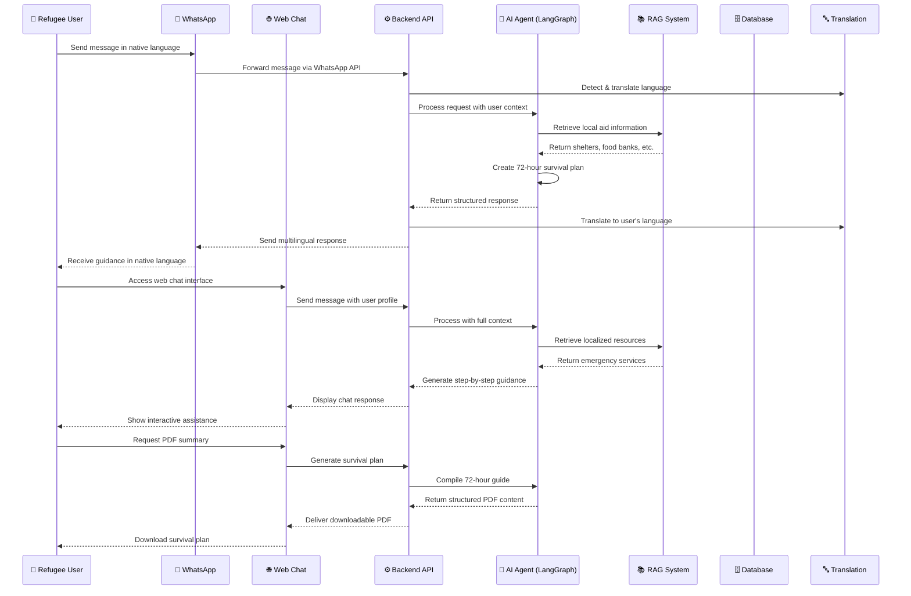

# 🌍 Refugee First – 72-Hour Support Agent

---

**Refugee First – 72 Hour Support Agent** is a multilingual AI assistant designed to guide refugees during the **critical first 72 hours** after arriving in a new city. It provides shelter guidance, food & water help, basic safety instructions, local navigation, and multilingual conversation — all without automating government or legal processes.

---

## 🧩 System Architecture



## ⚙️ Tech Stack

| Layer | Technology |
|-------|------------|
| Frontend | HTML,CSS,React,Tailwind,Typescript, JavaScript |
| Backend | FastAPI, LangGraph, RAG System |
| AI/ML | Vertex AI Embeddings, Groq API |
| Messaging | WhatsApp Cloud API |
| Database | MongoDB |
| Translation | Google Translate API |
| Hosting | Render / Local Testing |

## 🚀 Key Features

### 🔹 Multilingual Support
Arabic • Farsi • Hindi • Marathi • Urdu • English • French • Ukrainian • Tamil •

### 🔹 Dual Interface
- **WhatsApp Integration** - Instant messaging via familiar platform
- **Web Chat Portal** - Full-featured web interface

### 🔹 Intelligent Assistance
- **Local Aid Retrieval** - Find nearby shelters, food banks, emergency centers
- **72-Hour Survival Planning** - Step-by-step guidance for critical period
- **Safe AI System** - No legal or government process automation

### 🔹 Practical Outputs
- **Real-time Chat Guidance** - Interactive multilingual conversation
- **PDF Survival Plan** - Downloadable 72-hour action plan

## 🧪 Installation & Setup

### 1. Clone the Repository
```bash
git clone https://github.com/your-username/refugee-first.git
cd refugee-first
```

### 2. Backend Setup
```bash
cd backend
pip install -r requirements.txt
uvicorn main:app --reload --host 0.0.0.0 --port 8000
```

### 3. Frontend Setup
Open the landing page directly in your browser:
```bash
open landing/index.html
```

### 4. WhatsApp Integration (Optional)
1. Configure WhatsApp Cloud API credentials
2. Set up webhook endpoints in backend
3. Test messaging flow with sample numbers

## 📱 Usage Flow

### Web Portal
1. **Landing Page** → Learn about the service
2. **Onboarding** → Select language & location
3. **Authentication** → Login/Signup (Google/Email)
4. **Chat Interface** → Get AI-powered assistance
5. **PDF Export** → Download survival plan

### WhatsApp
1. **Save Contact** → Add Refugee First number
2. **Start Chat** → Send message in any supported language
3. **Automatic Detection** → System detects language and location
4. **Interactive Guidance** → Receive step-by-step support
5. **Resource Links** → Get localized aid information

## 🗂️ Project Structure

```
refugee-first/
├── landing/                 # Landing page
│   ├── index.html
│   ├── styles.css
│   └── script.js
├── onboarding/              # User onboarding flow
│   └── onboarding.html
├── auth/                    # Authentication pages
│   ├── login.html
│   └── signup.html
├── chat/                    # Main chat interface
│   ├── chat.html
│   ├── chat.css
│   └── chat.js
├── backend/                 # API and AI services
│   ├── agents/              # LangGraph agents
│   ├── rag/                 # Retrieval system
│   ├── whatsapp/            # WhatsApp integration
│   ├── models/              # Data models
│   └── main.py              # FastAPI application
└── docs/                    # Documentation
    ├── LICENSE.md
    └── API.md
```

## 🤖 How the AI Works

### 🟡 Step 1 — Classification
- Detects user's city and current location
- Assesses urgency level of situation
- Identifies primary language

### 🟢 Step 2 — RAG Retrieval
- Searches local aid databases
- Finds nearest shelters and food distribution
- Identifies emergency services

### 🟡 Step 3 — Planning
- Organizes information into 72-hour timeline
- Prioritizes immediate needs (shelter, food, safety)
- Creates actionable steps

### 🟢 Step 4 — Delivery
- Presents information via chat interface
- Offers PDF download option
- Maintains conversation context

## 🌐 Live Demo

**Web Portal:** [Try It Live](https://your-deployment-link.vercel.app)  
**Demo Video:** [Watch Overview](https://drive.google.com/file/d/1EvefO1SAihRdXT55CqyduXXM3emgixbw/view?usp=sharing)

## 🛡️ Safety & Ethics

- ✅ Provides information only, no automation of legal processes
- ✅ Respects user privacy and data protection
- ✅ Humanitarian focus only
- ❌ No government or legal advice
- ❌ No commercial data usage
- ❌ No surveillance capabilities

## 🤝 Contributing

We welcome contributions that align with our humanitarian mission. Please ensure all updates follow:

- Humanitarian guidelines and principles
- No legal process automation
- No commercial misuse
- Multilingual accessibility

## 📜 License

This project is licensed under the **Humanitarian Use Only** license.  
See the [LICENSE.md](LICENSE.md) file for details.

---
